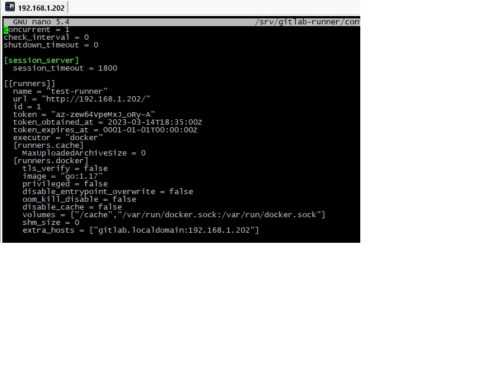

# Домашнее задание к занятию "`8.3. GitLab`" - `Дьяконов Алексей`

## Задание 1

`Gitlab развернул вручную`

-
-
-

## Задание 2

`.gitlab-ci.yml:`

stages:
  - test
  - static-analysis
  - build

test:
  stage: test
  image: golang:1.17
  script: 
   - go test .

static-analysis:
 stage: test
 image:
  name: sonarsource/sonar-scanner-cli
  entrypoint: [""]
 variables:
 script:
  - sonar-scanner -Dsonar.projectKey=test-1 -Dsonar.sources=. -Dsonar.host.url=http://gitlab.localdomain:9000 -Dsonar.login=sqp_508c00d57fe832b5867a2e2e32976f15abb4a80d

build:
  stage: build
  image: docker:latest
  only:
   - main
  script:
   - docker build .

-
-

## Задание 3
`.gitlab-ci.yml:`

stages:
  - test
  - static-analysis
  - build

test:
  stage: test
  image: golang:1.17
  script: 
   - go test .
  only: # test запускается только при изменении файлов *.go 
   changes:
    - "**/*.go"

static-analysis:
 stage: test
 image:
  name: sonarsource/sonar-scanner-cli
  entrypoint: [""]
 variables:
 script:
  - sonar-scanner -Dsonar.projectKey=test-1 -Dsonar.sources=. -Dsonar.host.url=http://gitlab.localdomain:9000 -Dsonar.login=sqp_508c00d57fe832b5867a2e2e32976f15abb4a80d

build:
  stage: build
  needs: [] # Job запускается сразу, не дожидаясь выполнения остальных
  image: docker:latest
  only:
   - main
  script:
   - docker build .
